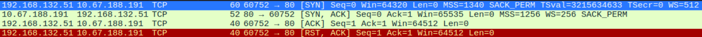

# TryHackMe — Nmap
**Dificultad** -> easy | **Date** -> 28-sep-26 | **Type** -> Free + Hands-On \
**Sala** -> [Nmap](https://tryhackme.com/room/furthernmap)
## Introducción
Análisis acerca del uso de la herramienta __Nmap__, una potente herramienta para el escaneo de redes.
## Solución
### Task 2 — Introduction
Entre más conocimiento se tenga de un objetivo, se tendrán más opciones para atacar a un sistema objetivo. Antes de realizar una audiotría de seguridad es necesario realizar un "mapeo" de la red a la que se le va a realizar dicha auditoría.

> [!NOTE]
> A un "mapeo" de red se le llama **Port scanning**.

> [!IMPORTANT]
> Cuando una computadora ejecuta un servicio de red abre un "puerto", donde recibirá la conexión. \
> Los puertos de red son necesarios para realizar múltiples peticiones o tener múltiples servicios disponibles.

> Las conexiones de red se hacen entre dos puertos
> - Puerto abierto escuchando en el servidor.
> - Puerto abierto aleatoriamente en el equipo local.

> [!TIP]
> Todas las computadoras tienen un total de **65535** puertos dispobibles.

**Nmap** se conectará a cada puerto del objetivo y dependiendo de la respuesta se puede determinar como: **abierto**, **cerrado** o **filtrado** (usualmente por un firewall).

___
*Pregunta 1: What networking constructs are used to direct traffic to the right application on a server?*
**Respuesta: ports**

*Pregunta 2: How many of these are available on any network-enabled computer?*
**Respuesta: 65535**

*Pregunta 3: __Research__ How many of these are considered "well-known"? (These are the "standard" numbers mentioned in the task)*
**Respuesta: 1024**

> Usar la pista de la sala. \
> **NOTA**: el 0 también cuenta

### Task 3 — Nmap switches

> **Nmap** está disponible para Windows y Linux. 

___
*Pregunta 1: What is the first switch listed in the help menu for a 'Syn Scan' (more on this later!)?* \
**Respuesta: `-sS`**

> **NOTA**: Utilizar `nmap -h` en lugar de `man nmap` y buscar en `Scan techniques`

*Pregunta 2: Which switch would you use for a "UDP scan"?* \
**Respuesta: `-sU`**

*Pregunta 3: If you wanted to detect which operating system the target is running on, which switch would you use?* \
**Respuesta: `-O`**

*Pregunta 4: Nmap provides a switch to detect the version of the services running on the target. What is this switch?* \
**Respuesta: `-sV`**

*Pregunta 5: The default output provided by nmap often does not provide enough information for a pentester. How would you increase the verbosity?* \
**Respuesta: `-v`**

*Pregunta 6: Verbosity level one is good, but verbosity level two is better! How would you set the verbosity level to two?* \
**Respuesta: `-vv`**

*Pregunta 7: We should always save the output of our scans -- this means that we only need to run the scan once (reducing network traffic and thus chance of detection), and gives us a reference to use when writing reports for clients.

What switch would you use to save the nmap results in three major formats?* \
**Respuesta: `-oA`**

> **NOTA**: Recordar la `A` al final del switch

*Pregunta 8: What switch would you use to save the nmap results in a "normal" format?* \
**Respuesta: `-oN`**

> **NOTA**: Recordar la `N` al final del switch

*Pregunta 9: A very useful output format: how would you save results in a "grepable" format?* \
**Respuesta: `-oG`**

*Pregunta 10: Sometimes the results we're getting just aren't enough. If we don't care about how loud we are, we can enable "aggressive" mode. This is a shorthand switch that activates service detection, operating system detection, a traceroute and common script scanning. How would you activate this setting?* \
**Respuesta: `-A`**

*Pregunta 11: Nmap offers five levels of "timing" template. These are essentially used to increase the speed your scan runs at. Be careful though: higher speeds are noisier, and can incur errors!

How would you set the timing template to level 5?* \
**Respuesta: `-T5`**

> **NOTA**: Revisar la documentación en línea

*Pregunta 12: We can also choose which port(s) to scan.

How would you tell nmap to only scan port 80?* \
**Respuesta: `-p 80`**

> **NOTA**: No utilizar `man`, utilizar la bandera `-h` para buscar más rápido

*Pregunta 13: How would you tell nmap to scan ports 1000-1500?* \
**Respuesta: `-p 1000-1500`**

*Pregunta 14: How would you tell nmap to scan all ports?* \
**Respuesta: `-p-`**

> **IMPORTANTE**: el segundo guión "quita" las condiciones de escaneo

*Pregunta 15: How would you activate a script from the nmap scripting library (lots more on this later!)?* \
**Respuesta: `--script`**

*Pregunta 16: How would you activate all of the scripts in the "vuln" category?* \
**Respuesta: `--script=vuln`**

> **NOTA**: Revisar la documentación en línea

### Scan types
#### Task 4 — Overview

| Banderas comúnes                                                                           | Banderas no tan comúnes                                                                   |
| ------------------------------------------------------------------------------------------ | ----------------------------------------------------------------------------------------- |
| `-sT` (Puertos TCP abiertos)<br>`-sS` (Escaneos "semiabiertos" SYN)<br>`-sU` (Escaneo UDP) | `-sN` (Escaneos nulos TCP)<br>`-sF` (Escaneos TCP FIN)<br>`-sX` (Escaneos TCP de Navidad) |

> [!NOTE]
> A excepción de los escaneos UDP, las demás banderas funcionan de forma muy similar pero varía la forma en la que funcionan.

___
**No se necesita respuesta**
#### Task 5 — TCP Connect Scans
El *TCP Connect Scan* realiza un three-way handshake con cada puerto del objetivo en turno y determina si el servicio está abierto con base a la respuesta recibida.

> [!TIP]
> **Las tres fases del Three-way Handshake**
> - El cliente envía un paquete TCP con la bandera *SYN*
> - El servidor responde con las banderas *SYN/ACK*
> - El cliente responde con la bandera *ACK*

> [!IMPORTANT]
> **¿Cómo determina Nmap si un puerto está cerrado?** \
> Para determinar que un puerto está cerrado Nmap envía una petición TCP con la bandera *SYN*. El servidor objetivo entonces responderá con la bandera *RST* (Reset). Con esta última bandera Nmap establece que el puerto está cerrado.

> Muchos firewalls están configurados para descartar paquetes entrantes. Nmap envía un paquete con la bandera *SYN* y no obtiene respuesta, esto indica que el puerto está protegido por un firewall y por lo tanto el puerto se considera *filtrado*.

___
*Pregunta 1: Which RFC defines the appropriate behaviour for the TCP protocol?* \
**Respuesta: RFC 9293**

> **NOTA**: Es el estándar actual y en la tarea aparece listado

*Pregunta 2: If a port is closed, which flag should the server send back to indicate this?* \
**Respuesta: RST**

> La mayoría de las banderas son abreviaciones de su significado (SYN -> Synchronization, ACK -> Acknowledge)

#### Task 6 — SYN Scans

> Los *SYN scans* son utilizados para escanear un rango de puertos en el objetivo u objetivos. Se les suele llamar "Half-open" o escaneos "sigilosos" ("stealth" scans).

> [!IMPORTANT]
> A diferencia del escaneo anterior que realizaba un three-way handshake completo, este escaneo envía de vuelta una bandera RST después de recibir las banderas SYN/ACK evitando que el servidor realice la solicitud varias veces

| Ventajas                                                                                                                                                                | Desventajas                                                         |
| ----------------------------------------------------------------------------------------------------------------------------------------------------------------------- | ------------------------------------------------------------------- |
| Se pueden eludir viejos IDS que buscan un threeway handshake completo.                                                                                                  | Requiere de permiso `sudo` para trabajar correctamente en Linux.    |
| No son registrados por las aplicaciones que están escuchando en puertos abiertos (el estándar es que se registre la conexión cuando ha sido establecida completamente). | Algunos servicios inestables pueden ser afectados por escaneos SYN. |
| Son significativamente más rápidos debido a que no se preocupan por completar el threeway handshake.                                                                    |                                                                     |

> [!WARNING]
> **Con respecto a `sudo`** \
> El usuario *root* es el único que puede crear paquetes sin procesar (raw packets) que por defecto solo él puede hacer.

> Los *SYN scans* son los escaneos por defecto en Nmap si se ejecuta con `sudo`.

> [!TIP]
> Si se escanean puertos cerrados o filtrados el comportamiento del escaneo es exactamente igual al *TCP Connect Scans*.
> - puerto cerrado: se envía una bandera RST
> - puerto filtrado: desecha el paquete (no hay respuesta) o se falsifica la bandera RST

___
*Pregunta 1: There are two other names for a SYN scan, what are they?* \
**Respuesta: Half-open, stealth**

*Pregunta 2: Can Nmap use a SYN scan without Sudo permissions (Y/N)?* \
**Respuesta: N**

>**NOTA**: Siempre se debe utilizar `sudo` si se quiere hacer un *stealth scan*.

#### Task 7 — UDP Scans
UDP a diferencia de TCP no crea una conexión. UDP envía los paquetes con la esperanza de que lleguen al puerto de destino. UDP es excelente para conexiones que requieran velocidad de conexión sobre la calidad de la misma.

> Debido a que UDP no sabe si el paquete llegó a su destino, es más difícil de escanear (además de ser más lento).

> Los puertos cerrados responden con un paquete ICMP (ping) e indiscutiblemente, el puerto UDP está cerrado

> [!NOTE]
> **¿Los puertos UDP responden?** \
> No debería de haber respuesta. Cuando esto ocurre, Nmap marca el puerto como `open|filtered`, es decir, puede estar abierto pero detrás de un firewall. \
> Si hay respuesta (que es extremadamente raro), se marca como abierto y se envía la solicitud una segunda vez, si no hay respuesta se vuelve al estado `open|filtered`.

> [!TIP]
> Es buena práctica ejecutar un escaneo con la opción `--top-ports <número>` para disminuír el tiempo de escaneo (en comparación, un escaneo TDP se puede ejecutar en ~20 minutos en los primeros 1000 puertos).

___
*Pregunta 1: If a UDP port doesn't respond to an Nmap scan, what will it be marked as?* \
**Respuesta: `open|filtered`**

*Pregunta 2: When a UDP port is closed, by convention the target should send back a "port unreachable" message. Which protocol would it use to do so?* \
**Respuesta: ICMP**
#### Task 8 — NULL, FIN and Xmas
No son tan populares y son extremadamente raros de utilizar principalmente porque son mucho más sigilosos que un *SYN Scan*.

| Escaneo  | ¿Qué hace?                                                                                                                                                                                                 | Bandera en Nmap |
| :------: | ---------------------------------------------------------------------------------------------------------------------------------------------------------------------------------------------------------- | :-------------: |
| **NULL** | La petición TCP se envía sin ninguna bandera. Según el **RFC** la víctima debería responder con un RST si el puerto está cerrado.                                                                          |      `-sN`      |
| **FIN**  | Funciona similar, pero en lugar de enviar un paquete completamente vacío, manda la bandera FIN que se utiliza para cerrar ordenadamente la conexión activa y una vez más la víctima responderá con un RST. |      `-sF`      |
| **Xmas** | Manda un paquete TCP "malformado". Espera una respuesta RST para los puertos cerrados.                                                                                                                     |      `-sX`      |

> [!TIP]
> **¡Luces navideñas!** \
> El escaneo de navidad (*Xmas scan*) envía un paquete con las banderas FIN, PSH y URG encendidas al mismo tiempo lo que hace que el paquete quede "iluminado" como un árbol de navidad.

> [!WARNING]
> **Ya sé como vas a reaccionar** \
> Al igual que en *UDP scan*, se espera este comportamiento si el puerto se protege con un firewall. Por lo tanto solo identificarán los puertos como: *open|filtered*, *closed* o *filtered*.

> Si el puerto se marca como filtrado, el puerto ha respondido con un paquete ICMP.

> [!TIP]
> RFC 793 dice que los host deben responder a paquetes malformados con la bandera RST en los puertos cerrados y no responder para los abiertos, Microsoft y Cisco no siguen esta regla. Ellos responden RST a cualquier caso haciendo que los puertos aparezcan como cerrados.

> El objetivo de estos escaneos es evadir el firewall

___
*Pregunta 1: Which of the three shown scan types uses the URG flag?* \
**Respuesta: xmas**

*Pregunta 2: Why are NULL, FIN and Xmas scans generally used?* \
**Respuesta: firewall evasion**

> **RECORDATORIO**: Muchos IDS modernos saben cómo funciona el *SYN Scan* tradicional

*Pregunta 3: Which common OS may respond to a NULL, FIN or Xmas scan with a RST for every port?* \
**Respuesta: Microsoft Windows**

> **NOTA**: tanto Microsoft como Cisco no siguen el **RFC 793**.

#### Task 9 — ICMP Network Scanning
Al conectarse por primera vez a una red objetivo, el primer paso es obtener el "mapa" de la red, es decir, qué direcciones IP tienen hosts activos y cuales no.

> Una forma de realizar este mapeo es con "ping sweep" (barrido de ping).

Nmap envía un paquete ICMP a cada una de las IP dentro de la red. Cuando la IP responde se marca como "viva".

> [!IMPORTANT]
> Cuando se hace un ping sweep no es del todo exacto marcar como "viva" a una IP. Puede proveer un poco de contexto, es importante remarcarlo.

Para realizar un ping sweep se utiliza la bandera `-sn` con el rango de IP
- Rango especificado con guión: `nmap -sn 192.168.0.1-254`
- Rango especificado con CIDR `nmap -sn 192.168.0.0/24`

La bandera `-sn` obliga a Nmap a no escanear ningún puerto y depender de paquetes ICMP para identificar a los objetivos.

> [!WARNING]
> Nmap además de enviar el paquete ICMP, también enviará un paquete SYN al puerto 443 del objetivo junto con un paquete ACK (o SYN si no es *root*) al puerto 80.

___
*Pregunta 1: How would you perform a ping sweep on the 172.16.x.x network (Netmask: 255.255.0.0) using Nmap? (CIDR notation)* \
**Respuesta: `nmap -sn 172.16.0.0/16`**

### NSE Scripts
#### Task 10 — Overview

> NSE = **N**map **S**cripting **E**ngine

Están escritos en el lenguaje de programación Lua y se pueden utilizar para gran variedad de cosas, desde escaneo por vulnerabilidades, hasta automatizar exploits para ellas.

Las categorías más útiles de NSE son
- `safe`: No afecta al objetivo
- `intrusive`: Afecta al objetivo
- `vuln`: Escanea por vulnerabilidades
- `exploit`: Intenta explotar una vulnerabilidad
- `auth`: Intenta saltar una autenticación para correr servicios
- `brute`: Intenta obtener credenciales por fuerza bruta para ejecutar servicios
- `discovery`: Intenta hacer una petición para ejecutar servicios para futura información acerca de la red

> Otras categorías se pueden encontrar [aquí](https://nmap.org/book/nse-usage.html)

___
*Pregunta 1: What language are NSE scripts written in?* \
**Respuesta: Lua**

*Pregunta 2: Which category of scripts would be a very bad idea to run in a production environment?* \
**Respuesta: `intrusive`**

> **TIP**: afecta al objetivo

#### Task 11 — Working with the NSE
Para ejecutar un script específico se utiliza la bandera `--script=<SCRIPT_NAME>` (`--script=auth`). También se pueden ejecutar varios scripts al mismo tiempo separados por una coma `--scripts=http-brute,smb-enum-shares`.

> [!TIP]
> Algunos scripts requieren argumentos que se pueden activar con la bandera `--script-args` \
> `nmap -p 80 --script http-put --script-args http-put.url='/dav/shell.php',http-put.file='./shell.php'` (los argumentos deben ser separados por una coma '`,`' y conectado al script correspondiente con un punto '`.`')

***
*Pregunta 1: What optional argument can the `ftp-anon.nse` script take?* \
**Respuesta: `maxlist`**

> **PRECAUCIÓN**: existen dos scripts para `ftp` en la documentación

#### Task 12 — Searching for Scripts
Hay dos formas de encontrar los scripts en Nmap
- El [sitio oficial](https://nmap.org/nsedoc/)
- De forma local (en Linux, Nmap almacena los scripts en `/usr/share/nmap/scripts`)

> [!NOTE]
> Dentro del directorio `scripts` existe un fichero llamado `script.db` sin embargo, la extensión es un "comodín", es un archivo de texto plano que contiene los nombres de los archivos y categorías

> Formas de buscar en la base de datos
> - Utilizando el comando `grep`: `grep "ftp" /usr/share/nmap/scripts/script.db`
> - Utilizando el comando `ls`: `ls -l /usr/share/nmap/scripts/*ftp*`

> [!IMPORTANT]
> Para instalar scripts que se haya "perdido" descargando el script específico \
> `sudo wget -o /usr/share/nmap/scripts/<SCRIPT_NAME>.nse https://svn.nmap.org/nmap/scripts/<SCRIPT_NAME>.nse && nmap --script-updatedb`

___
*Pregunta 1: Search for "smb" scripts in the `/usr/share/nmap/scripts/` directory using either of the demonstrated methods.  
What is the filename of the script which determines the underlying OS of the SMB server?*
**Respuesta: `smb-os-discovery.nse`**

*Pregunta 2: Read through this script. What does it depend on?* \
**Respuesta: `smb-brute`**

> **NOTA**: utilizar el comando `grep -w` junto con la pista desplegada

### Task 13 — Firewall Evasion
Un host de Windows común bloquea por defecto todos los paquetes ICMP entrantes y esto es contraproducente ya que no solo se utiliza el comando `ping` para revisar si un objetivo está activo (Nmap lo hace por defecto).

> Nmap registrará a un objetivo como inactivo con esta configuración de firewall y ni siquiera hará el intento de escanearlo 

> [!TIP]
> Para obligar a Nmap a escanear todos los hosts se puede utilizar la bandera `-Pn` que tratará a todos los objetivos como si estuvieran activos ya que no se molestará en enviar un paquete ICMP primero

> Si ya se está dentro de la red local, Nmap utilizará ARP para revisar la actividad del host.

| Bandera                   | ¿Qué hace?                                                                                                                                    |
| ------------------------- | --------------------------------------------------------------------------------------------------------------------------------------------- |
| `-f`                      | Fragmenta los paquetes haciendo más complicado el que el firewall o el IDS los identifiquen                                                   |
| `--mtu <número>`          | Similar al anterior, pero otorga más control aceptando una unidad máxima de transmisión para los paquetes enviados (deben ser múltiplos de 8) |
| `--scan-delay <tiempo>ms` | Agrega un retraso entre los paquetes enviados. Muy útil si la red es inestable y también bueno para evadir IDS/Firewall basados en tiempo     |
| `--badsum`                | Genera un checksum inválido para los paquetes. Puede ser utilizado para verificar la existencia de un firewall o un IDS.                      |
Estas banderas son peculiares a destacar, sin embargo se pueden revisar otras banderas [aquí](https://nmap.org/book/man-bypass-firewalls-ids.html)

> [!NOTE]
> **Acerca de la bandera `--badsum`** \
> Cualquier stack TCP/IP desecharía un paquete con un checksum inválido pero algunos IPS/Firewalls pueden responder automáticamente sin siquiera revisar si el checksum es válido o no.

___
*Pregunta 1: Which simple (and frequently relied upon) protocol is often blocked, requiring the use of the `-Pn` switch?* \
**Respuesta: `ICMP`**

> **RECORDATORIO**: por defecto los host de Windows bloquea los paquetes ICMP

*Pregunta 2: (Research) Which Nmap switch allows you to append an arbitrary length of random data to the end of packets?* \
**Respuesta: `--data-length`**

> **NOTA**: Utilizar el manual de Nmap  y buscar **random** \
> **Palabras clave** -> *random data*

### Task 14 — Practical
___
*Pregunta 1: Does the target ip respond to ICMP echo (ping) requests (Y/N)?* \
**Respuesta: N**

```bash
ping <MACHINE_IP>
```

*Pregunta 2: Perform an Xmas scan on the first 999 ports of the target -- how many ports are shown to be open or filtered?* \
**Respuesta: 999**

```bash
# Utilizar la bandera '-Pn' para obligar a Nmap a escanear todos los puertos
# esten activos o no

# La bandera '-sX' realiza el escaneo de navidad y la bandera '-p' se utiliza para los puertos que queremos escanear
nmap -sX -Pn -p 999 <MACHINE_IP>
```

> **NOTA**: *NO* utilizar un rango de IP con la bandera `-p`

*Pregunta 3: There is a reason given for this -- what is it? \
**Note:** The answer will be in your scan results. Think carefully about which switches to use -- and read the hint before asking for help!*
**Respuesta: `no response`**

```bash
# Volver a ejecutar el comando anterior con un agregado
# La bandera '-vv' es el modo verboso
nmap -sX -Pn -p 999 -vv <MACHINE_IP>

Starting Nmap 7.99 ( https://nmap.org ) at 2026-10-05 19:25 -0400
Initiating Parallel DNS resolution of 1 host. at 19:25
Completed Parallel DNS resolution of 1 host. at 19:25, 2.53s elapsed
Initiating XMAS Scan at 19:25
Scanning <MACHINE_IP> [1 port]
Completed XMAS Scan at 19:25, 2.05s elapsed (1 total ports)
Nmap scan report for <MACHINE_IP>
Host is up, received user-set.
Scanned at 2026-10-05 19:25:08 EDT for 2s
PORT    STATE         SERVICE REASON
```

> El modo verboso muestra una nueva columna llamada `REASON`. Siempre prestar atención a las "razones" por las cuales se da un estado (`open`, `closed`, `open|filtered`).

*Pregunta 4: Perform a TCP SYN scan on the first 5000 ports of the target -- how many ports are shown to be open?* \
**Respuesta: 5**

```bash
# Utilizar la bandera '-sT' para realizar un escaneo de puertos TCP abiertos
nmap -sT -Pn -p 0-5000 -vv <MACHINE_IP>
Starting Nmap 7.99 ( https://nmap.org ) at 2026-10-05 19:36 -0400
Initiating Parallel DNS resolution of 1 host. at 19:36
Completed Parallel DNS resolution of 1 host. at 19:36, 2.51s elapsed
Initiating Connect Scan at 19:36
Scanning <MACHINE_IP> [5001 ports]
Discovered open port 80/tcp on <MACHINE_IP>
Discovered open port 21/tcp on <MACHINE_IP>
Discovered open port 3389/tcp on <MACHINE_IP>
Discovered open port 135/tcp on <MACHINE_IP>
Discovered open port 53/tcp on <MACHINE_IP>
Completed Connect Scan at 19:36, 16.63s elapsed (5001 total ports)
Nmap scan report for <MACHINE_IP>
Host is up, received user-set (0.064s latency).
Scanned at 2026-10-05 19:36:39 EDT for 17s
Not shown: 4996 filtered tcp ports (no-response)
PORT     STATE SERVICE       REASON
21/tcp   open  ftp           syn-ack
53/tcp   open  domain        syn-ack
80/tcp   open  http          syn-ack
135/tcp  open  msrpc         syn-ack
3389/tcp open  ms-wbt-server syn-ack

Read data files from: /usr/share/nmap
Nmap done: 1 IP address (1 host up) scanned in 19.16 seconds
```

> Ahora se deben de utilizar rangos ya que estamos escaneando específicamente puertos TCP. Se mantienen las otras banderas del comando anterior.

*Pregunta 5: Open Wireshark and perform a TCP Connect scan against port 80 on the target, monitoring the results. Make sure you understand what's going on. Deploy the `ftp-anon` script against the box. Can Nmap login successfully to the FTP server on port 21? (Y/N)*
**Respuesta: Y**

```bash
# Primero realizar un escaneo TCP al puerto 80 para determinar si está activa la conexión
nmap -sT -Pn -p 80 -vv <MACHINE_IP>
Starting Nmap 7.99 ( https://nmap.org ) at 2026-10-05 21:06 -0400
Initiating Parallel DNS resolution of 1 host. at 21:06
Completed Parallel DNS resolution of 1 host. at 21:06, 2.54s elapsed
Initiating Connect Scan at 21:06
Scanning <MACHINE_IP> [1 port]
Discovered open port 80/tcp on <MACHINE_IP>
Completed Connect Scan at 21:06, 0.06s elapsed (1 total ports)
Nmap scan report for <MACHINE_IP>
Host is up, received user-set (0.062s latency).
Scanned at 2026-10-05 21:06:48 EDT for 0s

PORT   STATE SERVICE REASON
80/tcp open  http    syn-ack

Read data files from: /usr/share/nmap
Nmap done: 1 IP address (1 host up) scanned in 2.62 seconds
```



> - `SYN-SYN/ACK-ACK` detectado. Se establece la conexión
> - `RST/ACK` se intenta una vez mas el Threeway handshake. Posible desecho de paquetes ICMP

```bash
# Se ejecuta nmap una vez más con la bandera '-sV' y '-sC'
nmap -Pn -sV -sC <MACHINE_IP>
Starting Nmap 7.99 ( https://nmap.org ) at 2026-10-05 21:17 -0400
Nmap scan report for <MACHINE_IP>
Host is up (0.062s latency).
Not shown: 995 filtered tcp ports (no-response)
PORT     STATE SERVICE       VERSION
21/tcp   open  ftp           FileZilla ftpd 0.9.60 beta
| ftp-anon: Anonymous FTP login allowed (FTP code 230)
|_Can't get directory listing: TIMEOUT
| ftp-syst: 
|_  SYST: UNIX emulated by FileZilla
53/tcp   open  domain        Simple DNS Plus
80/tcp   open  http          Microsoft IIS httpd 10.0
|_http-title: IIS Windows Server
| http-methods: 
|_  Potentially risky methods: TRACE
|_http-server-header: Microsoft-IIS/10.0
135/tcp  open  msrpc         Microsoft Windows RPC
3389/tcp open  ms-wbt-server Microsoft Terminal Services
|_ssl-date: 2026-10-06T01:18:22+00:00; +9s from scanner time.
| ssl-cert: Subject: commonName=win-scan
| Not valid before: 2026-10-04T23:08:53
|_Not valid after:  2027-04-05T23:08:53
| rdp-ntlm-info: 
|   Target_Name: WIN-SCAN
|   NetBIOS_Domain_Name: WIN-SCAN
|   NetBIOS_Computer_Name: WIN-SCAN
|   DNS_Domain_Name: win-scan
|   DNS_Computer_Name: win-scan
|   Product_Version: 10.0.17763
|_  System_Time: 2026-10-06T01:17:51+00:00
Service Info: OS: Windows; CPE: cpe:/o:microsoft:windows

Host script results:
|_clock-skew: mean: 8s, deviation: 0s, median: 7s

Service detection performed. Please report any incorrect results at https://nmap.org/submit/ .
Nmap done: 1 IP address (1 host up) scanned in 46.01 seconds
```

> - La bandera `-sV` prueba todos los puertos para determinar qué servicio se está ejecutando junto a su versión
> - La bandera `-sC` ejecuta el script por defecto, que en este caso es `ftp-anon`

> Revisando la salida del comando anterior, el estado del puerto 21 (FTP) es `open`, por lo tanto se puede establecer conexión.
## Lecciones aprendidas
- Nmap es una herramienta de reconocimiento de red.
- Entre más se conozca del objetivo, será más fácil atacar dicho objetivo.
- Los mapeos de red son conocidos como **Port Scanning**
- Las conexiones de red son entre dos puertos: uno de escucha en el servidor y otro en el equipo local que se abre aleatoriamente (ejemplo: conexión `HTTPS` en el puerto 443 y en el equipo local se abre el puerto 17500)
- Todas las computadoras tienen un total de 65535 puertos disponibles
- Hay un total de 1024 puertos "well-known" (bien conocidos)
- Nmap está disponible tanto en Linux como en Windows (Kali Linux lo tiene instalado por defecto)
- Existen varios tipos de escaneo pero los más importantes son: *TDP Scans* y *UDP Scans*
- No es normal que los puertos UDP se marquen como abiertos, Nmap enviará la petición una segunda vez, si se marca como `open|filtered` entonces no se obtuvo respuesta
- La respuesta que da un puerto UDP es un paquete ICMP, lo que quiere decir que está cerrado sin duda
- El escaneo *Xmas* es particular ya que manda un paquete "malformado" (banderas FIN, PSH y URG encendidas), de ahí el nombre, ya que parece un "árbol de navidad" encendido
- Los escaneos FIN, NULL y Xmas son más sigilosos que un escaneo SYN
- El *SYN Scan* es sigiloso ya que no completa el threeway handshake
- Cuando se conecta a una red, lo primero que se debe de hacer es obtener los hosts que están activos, ahí entra en juego el escaneo ICMP
- *Ping sweep* manda un paquete ICMP a cada una de las direcciones de red para determinar cuales están activos
- **NSE** es el acrónimo de *Nmap Scripting Engine*
- Los scripts ses dividen en categorías y están escritos en Lua
- Se puede ejecutar más de un script al mismo tiempo con la bandera `--scripts=<script_1>,<script_2>`
- El script por defecto en Nmap es `ftp-anon` que se puede ejecutar con la bandera `-sC`
- Por defecto, un host de Windows descarta los paquetes ICMP entrantes
- La bandera `-Pn` obliga a Nmap a realizar un escaneo de toda la red ya que los tratará a todos como activos y no mandará ningún paquete ICMP (Ping)